<!-- 
  ╔══════════════════════════════════════════════╗
  ║  Welcome to my GitHub Profile!               ║
  ║  This README features an interactive pixel   ║
  ║  art room. Click the banner to explore!      ║
  ╚══════════════════════════════════════════════╝
-->

<!-- Animated Room Header — Click to Enter -->

 

### `> welcome to my workspace_`

  

---

### 🎮 Enter My Room

> Walk around my virtual dev room with **WASD** keys.  
> Interact with objects to learn about my **projects**, **tech stack**, and **interests**.

---

### 💻 Tech Stack

  
  
  
  
  
  
  
  
  

---

### 📊 GitHub Stats

  
  

---

  🕹️ This profile features an <a href="https://pranav6004.github.io/pranav6004/">interactive pixel art room</a> — built with vanilla HTML5 Canvas, zero dependencies. 
  ⭐ Star this repo if you think it's cool!

